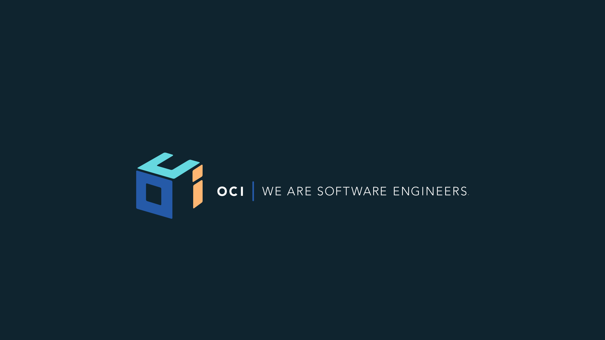

footer: © Object Computing Inc., 2018
slidenumbers: true




[.hide-footer]

# [FIT] GORM Data Services
> Taking Your GORM to the Next Level
-- by Graeme Rocher


---


[.hide-footer]

# Agenda

* Introduction to Data Services
* Why Data Services
* What's possible with Data Services
* Demos!

---


[.hide-footer]

# Why Data Services?

* Users often don't correctly define transaction semantics

```java
class BookController {
	// missing @ReadOnly !
	List<Book> list() { Book.list() }
}

```

* Can lead to performance problems


---


[.hide-footer]

# Why Data Services?

* Users often don't correctly define joins

```java
class BookController {
	// missing fetch: [authors: "join"]
	List<Book> list() { Book.list() }
}

```

* Can lead to performance problems

---


[.hide-footer]

# Why Data Services?

* Efficiency of update operations

```java
class BookService {
	@Transactional
	Book update(Long id, String title) {
		Book b = Book.get(id)
		b.title = title
		b.save() // updates all properties instead of just title
	}
}

```

---


[.hide-footer]

# Why Data Services?

* Making Multi-Tenancy development easier

```java
class BookService {
	@Transactional
	Book get(Long id) {
		Book.withTenant("blah") { Book.get(id) }
	}
}
```
- Wrapping every call with `withTenant` gets boring 


---


[.hide-footer]

# [fit] DEMO

* Data Service Basics

---


[.hide-footer]

# Intelligent Transaction Demarcation

- GORM will automatically apply correct semantics

```java
@Service(Book)
interface BookService {
	
	// read-only semantics
	Book get(Long id) 

	// write semantics
	Book update(Long id, String title) 
}
```

---


[.hide-footer]

# Optimized Writes

- Use @Query to optimize writes (no optimistic locking required)

```groovy
@Service(Product)
interface ProductService {
    @Query("""update ${Product p} 
    		  set ${p.type} = $type 
		  	  where ${p.id} = $id""")
    void update(Long id, String type)
}
```

---


[.hide-footer]

# Optimized Writes

- Use batch update/delete queries is more efficient!

```groovy
@Service(Product)
interface ProductService {
    // optimized batch deletes
    void delete(String name, String type)
}
```

---


[.hide-footer]

# Optimized Reads

- Golden Rule: If you are going to need the data, you need a join

```java
@Service(Product)
interface ProductService {
	// Use @Join to apply join semantics on associations
	@Join("attributes")
    Product find(String name)
}
```

---


[.hide-footer]

# Optimized Reads

- Use JPA-QL if necessary to perform joins. 

```groovy
@Service(Club)
interface ClubService {
	// More efficient data fetching with joins
    @Query("""select $c.name, $s.capacity from ${Club c} 
                inner join ${Stadium s = c.stadium}""")
    List<Map<String, Integer>> findStadiumCapacities()
}
```

---


[.hide-footer]

# Optimized Reads

- Golden Rule: Only read the data you actually need

```groovy
@Service(Product)
interface ProductService {
	// JPA-QL to fetch subset of data
    @Query("""select new map(${p.type} as type, ${p.name} as name) 
    		  from ${Product p} where ${p.name} = $name""")
    Map<String, Object> findProductInfo(String name)

    // Project on a single property
	String findProductType(String name)
}
```

---


[.hide-footer]

# [fit] DEMO

* Multi-Tenancy with Data Services